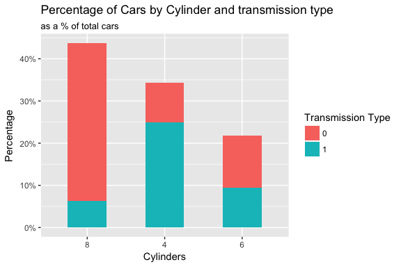

Graphing Examples with ggplot2
================
Brandon Hoeft
January 21, 2018

-   [Introduction](#introduction)
-   [ggplot philosophy](#ggplot-philosophy)
-   [Data](#data)
-   [Bar Plots](#bar-plots)
    -   [Plotting Total Frequency by Category](#plotting-total-frequency-by-category)
    -   [Plotting Relative Frequency by Category](#plotting-relative-frequency-by-category)
    -   [Plotting Joint Distributions of 2 Categorical Variables](#plotting-joint-distributions-of-2-categorical-variables)
    -   [Plotting Conditional Distribution of 2 Categorical Variables](#plotting-conditional-distribution-of-2-categorical-variables)
    -   [Make the plot Presentable](#make-the-plot-presentable)
    -   [Plots for many categories](#plots-for-many-categories)

Introduction
------------

This serves as a starting template for some coding basics with `ggplot2` for `r` data vizualizations. The best source for more information on resources is the [ggplot2 website](http://ggplot2.tidyverse.org). To work through the coding nuances, [Stackoverflow](www.stackoverflow.com) has been my go to resource for hacking certain visual elements of plots. Usually any question I've had, someone else has asked and had answered.

ggplot philosophy
-----------------

The grammar of graphics philosophy is largely inspired by the book **Grammar of Graphics** by Leland Wilkinson, which tries to answer the question of "What is a statistical graph?"

[Rick Scavetta](https://twitter.com/rick_scavetta?lang=en) in his course [Data visualisation with ggplot2](https://www.datacamp.com/courses/data-visualization-with-ggplot2-1) provides a great outline of major ggplot grammatical components to consider when designing a statistical graph. The grammar of graphics is basically composed of 2 principles:

1.  Graphs are distinct layers of **grammatical elements**.The data and geometric shapes applied to them are like the nouns and adjectives of the grammar of graphics.
2.  Useful plots are built around appropriate **aesthetic mappings**. These mappings are like the rules for assembling the graphical vocabulary into something meaningful.

There are 7 grammatical elements. The first 3 are essential for any plot using `ggplot2` to render. The last 4 are optional, but enable important customization and tweaking of plots.

<table class="table table-striped table-hover" style="margin-left: auto; margin-right: auto;">
<thead>
<tr>
<th style="text-align:left;">
Element
</th>
<th style="text-align:left;">
Importance
</th>
<th style="text-align:left;">
Description
</th>
</tr>
</thead>
<tbody>
<tr>
<td style="text-align:left;">
Data
</td>
<td style="text-align:left;">
Essential
</td>
<td style="text-align:left;">
The dataset being plotted
</td>
</tr>
<tr>
<td style="text-align:left;">
Aesthetics
</td>
<td style="text-align:left;">
Essential
</td>
<td style="text-align:left;">
The scales onto which we 'map' our data (x-axis, y-axis, color, fill, size, labels, shape, linetype, linewidth, alpha)
</td>
</tr>
<tr>
<td style="text-align:left;">
Geometrics
</td>
<td style="text-align:left;">
Essential
</td>
<td style="text-align:left;">
Visual Elements used to project the data (lines, boxplot, histogram, bars, points)
</td>
</tr>
<tr>
<td style="text-align:left;">
Facets
</td>
<td style="text-align:left;">
Optional
</td>
<td style="text-align:left;">
Plotting comparative subsets of data (subset plots by a categorical variable)
</td>
</tr>
<tr>
<td style="text-align:left;">
Statistics
</td>
<td style="text-align:left;">
Optional
</td>
<td style="text-align:left;">
Aid visual understanding (binning, smoothing, descriptive, inference)
</td>
</tr>
<tr>
<td style="text-align:left;">
Coordinates
</td>
<td style="text-align:left;">
Optional
</td>
<td style="text-align:left;">
The space on which the data is plotted (cartesian, fixed, limits, polar)
</td>
</tr>
<tr>
<td style="text-align:left;">
Themes
</td>
<td style="text-align:left;">
Optional
</td>
<td style="text-align:left;">
All non-data ink (tickmarks, axis labels)
</td>
</tr>
</tbody>
</table>
Together, these grammatical elements form building blocks that allow a user to create anything from standard plots to inventing new plots because of a flexible grammatical framework, and not a limited set of pre-packaged plot types.

Data
----

Initial examples will be applied using the built-in `mtcars` dataset. Other datasets may be incorporated as needed for different plots in the future.

The structure of your data will be crucially important for ggplot graphs. Most plots require a tidy dataset, where variables are represented in a single column, not spread amongst many columns. This is important for instance if you want to facet a plot, or you want to fill in the color of scatter plot points with the value of another variable. The values of that variable would need to exist in the same vector.

``` r
library(ggplot2)
library(dplyr)

cars <- mtcars
cars$car <- rownames(cars)
str(mtcars)
```

    'data.frame':   32 obs. of  11 variables:
     $ mpg : num  21 21 22.8 21.4 18.7 18.1 14.3 24.4 22.8 19.2 ...
     $ cyl : num  6 6 4 6 8 6 8 4 4 6 ...
     $ disp: num  160 160 108 258 360 ...
     $ hp  : num  110 110 93 110 175 105 245 62 95 123 ...
     $ drat: num  3.9 3.9 3.85 3.08 3.15 2.76 3.21 3.69 3.92 3.92 ...
     $ wt  : num  2.62 2.88 2.32 3.21 3.44 ...
     $ qsec: num  16.5 17 18.6 19.4 17 ...
     $ vs  : num  0 0 1 1 0 1 0 1 1 1 ...
     $ am  : num  1 1 1 0 0 0 0 0 0 0 ...
     $ gear: num  4 4 4 3 3 3 3 4 4 4 ...
     $ carb: num  4 4 1 1 2 1 4 2 2 4 ...

Bar Plots
---------

### Plotting Total Frequency by Category

Maybe we want to see how many of the 32 have certain cylinder types. A simple barplot will do the trick. Simply map the *cyl* variable to the x-axis aesthetic and add the geom\_bar function. The y-axis will automatically apply a count of records by *cyl*. By default the statistical transformation for geom\_bar is a count statistic. See documentation for further details.

``` r
ggplot(cars, aes(x = factor(cyl))) +
    geom_bar()
```


Another way to generate identical plot as above could include explicitely calling y-axis aesthetic with ..count..

This is a special variable in ggplot with double periods around it (..count.., ..density.., etc.). These are a stat transformation in an internal data frame based off the original data set. Under the hood, the API is counting the number of records by cylinder.

``` r
ggplot(cars, aes(x = factor(cyl), y = ..count..)) +
    geom_bar()
```

A third way to easily generate this same graph as above is to wrangle the data into counts by **cyl** first, and then plot the count values from your new data frame. Two things change here, the data being input into ggplot and the statistical mapping will change from the default to explicitely having to pass the "identity" statistical transformation. This tells ggplot to read the data as it already is, no calculation needed.

``` r
cars %>%
    group_by(cyl) %>%
    summarize(car_count = n()) %>%
    ggplot(aes(x = factor(cyl), y = car_count)) +
        geom_bar(stat = "identity")
```

### Plotting Relative Frequency by Category

To continue to develop the plot to describe the data, let's loook at:

-   relative frequency of cylinders instead of nominal frequency
-   convert the y-axis scales to percent instead of proportion
-   update the y-axis label
-   shorten the width of the bars to reduce unnecessary ink

``` r
ggplot(cars, aes(x = forcats::fct_infreq(factor(cyl)), 
                 y = (..count..)/sum(..count..))) + # change order of bars with fct_infreq from forcats. 
    geom_bar(width = .5) + # default bar width = 0.9
    labs(x = "Cylinders",
         y = "Percentage",
         title = "Car Relative Frequency by Cylinder type") +
    scale_y_continuous(labels = scales::percent) # from scales library
```


The following code generates identical plot as above, but pre-processes the relative frequencies earlier in a new data frame outside of `ggplot2`. This coded is provided as an alternative, but neither way is better than the other. It's all a personal preference and shows some of the flexibility of the library's interface.

``` r
# The proceeding code generates identical plot to code above, 
# but pre-processes the relative frequencies in data frame and not in ggplot2.
cars %>%
    group_by(cyl) %>%
    summarize(car_count = n()) %>%
    ggplot(aes(x = reorder(factor(cyl), desc(car_count)), 
               y = car_count / sum(car_count))) +
        geom_bar(stat = "identity", width = .5) + 
        labs(x = "Cylinders",
             y = "Percentage",
             title = "Car Relative Frequency by Cylinder type") +
        scale_y_continuous(labels = scales::percent) 
```


### Plotting Joint Distributions of 2 Categorical Variables

Let's continue exploring these data in bar plots by trying to understand how many cars in the dataset have certain combinations of cylinder and transmission type. To do this we can

-   find and plot the [joint distributions](https://en.wikipedia.org/wiki/Joint_probability_distribution) of cylinders vs. automatic transmission (am)

Again, a reminder of how our data is structured for these variables of interest. These are in a tidy format for incorporating multiple dimensions into a bar plot. Automatic/Manual is it's own variable as is cylinder. *This would be untidy if Automatic/Manual were one-hot encoded, representing 2 separate dummy variables.*

``` r
cars %>%
    select(car, cyl, am) %>%
    slice(1:10) # preview
```

    # A tibble: 10 x 3
                     car   cyl    am
                   <chr> <dbl> <dbl>
     1         Mazda RX4     6     1
     2     Mazda RX4 Wag     6     1
     3        Datsun 710     4     1
     4    Hornet 4 Drive     6     0
     5 Hornet Sportabout     8     0
     6           Valiant     6     0
     7        Duster 360     8     0
     8         Merc 240D     4     0
     9          Merc 230     4     0
    10          Merc 280     6     0

``` r
ggplot(cars, aes(x = forcats::fct_infreq(factor(cyl)), 
                 y = (..count..)/sum(..count..),
                 fill = factor(am))) +  
    geom_bar(width = .5) + 
    labs(x = "Cylinders",
         y = "Percentage",
         fill = "Transmission Type",
         title = "Percentage of Cars by Cylinder and transmission type",
         subtitle = "as a % of total cars") +
    scale_y_continuous(labels = scales::percent) 
```



We have a vizualization of the joint distribution of the relative frequency cars by cylinder and transmission type. One problem with **stacking** the transmission types on top each other (the default) may be that it's hard to understand the % of manual transmission cars by cylinder (because they start above 0% position on y-axis). So a couple refinements to make:

-   "dodging" the position of the bars within each column so everything can be compared to 0% on y-axis
-   update the legend title in the code to be more descriptive.

``` r
ggplot(cars, aes(x = forcats::fct_infreq(factor(cyl)), 
                 y = (..count..)/sum(..count..),
                 fill = factor(am))) + 
    geom_bar(width = .5, position = "dodge") +
    labs(x = "Cylinders",
         y = "Percentage",
         fill = "Transmission Type", # changed the label of legend.
         title = "% of Total Cars by Cylinder and transmission type",
         subtitle = "joint probability distribution") +
    scale_y_continuous(labels = scales::percent) 
```

 Note that I also changed the label of the legend in the code from its default to be more descriptive.

The above effectively plots the [joint distribution](https://en.wikipedia.org/wiki/Joint_probability_distribution) of Cylinders vs. Transmission. It's the same representation as this table.

``` r
round(prop.table(table(cylinders = cars$cyl, transmission_type = cars$am)), 2)
```

             transmission_type
    cylinders    0    1
            4 0.09 0.25
            6 0.12 0.09
            8 0.38 0.06

### Plotting Conditional Distribution of 2 Categorical Variables

Sometimes we may not care at all about the join distribution between 2 variables. We may instead be focused on whether or not transmission type is dependent upon cylinders. In this case we're curious about the [conditional distribution](https://en.wikipedia.org/wiki/Conditional_probability_distribution) in the data. What's the probability of the transmission type given the cylinder type? Also expressed as **p(transmission type | cylinder)**. How can we refactor our code to look at the relative frequency of transmission type conditioned on cylinder type?

If we want to look at relative freqeuncy of transmission type by cylinder, we still need the joint distribution of transmission type and cylinder that we had before, but then divide it by the marginal probability of that cylinder type in general. `prop.table` can automate this for us. This is also expressed as the joint distribution divided by the marginal distribution:

p(transmission type | cylinder) = p(transmission type, cylinder) / p(cylinder)

``` r
round(prop.table(table(cylinders = cars$cyl, transmission = cars$am), margin = 1), 2)
```

             transmission
    cylinders    0    1
            4 0.27 0.73
            6 0.57 0.43
            8 0.86 0.14

We can convert these conditional probabilities above into a dataframe in a couple different ways, and then pass them into our ggplot. **Version1** converts a prop.table into a dataframe. **Version2** wrangles the data in `dplyr` first and passes the conditional frequencies into the plot.

Note also that plot elements can be assigned to objects.

``` r
# demonstration. Not used for plot. 
version1 <- data.frame(prop.table(table(cars$cyl, cars$am), margin = 1), 2) %>%
    rename(cyl = Var1,
           am = Var2,
           relative_freq = Freq)

# dplyr version to derive the conditional probabilities, used for the plot.
version2 <- cars %>%
    group_by(cyl, am) %>% 
    summarize(freq = n()) %>% # identify joint frequencies of cylinder & transmission
    group_by(cyl) %>% # roll back grouping to cylinder level.
    mutate(relative_freq = freq / sum(freq)) # calculate transmission type given cylinder type. 
version2
```

    # A tibble: 6 x 4
    # Groups:   cyl [3]
        cyl    am  freq relative_freq
      <dbl> <dbl> <int>         <dbl>
    1     4     0     3     0.2727273
    2     4     1     8     0.7272727
    3     6     0     4     0.5714286
    4     6     1     3     0.4285714
    5     8     0    12     0.8571429
    6     8     1     2     0.1428571

``` r
plot <- ggplot(version2, aes(x = factor(cyl), 
                     y = relative_freq,
                     fill = factor(am))) + 
    geom_bar(stat = "identity", width = .5, position = "dodge") +
    labs(x = "Cylinders",
         y = "% of Cylinder",
         fill = "Transmission Type", # changed the label of legend.
         title = "Probability of Transmission Type Conditioned by Cylinders")
plot
```


### Make the plot Presentable

You may want to modify other aesthetics, coordinates, themes (these are to show how the grammatical elements combine together) to make the graph fit your needs. Here are a few examples of how you can refine your plot using some of the other grammatical elements of `ggplot2`.

-   add labels of the nominal frequencies on top of each bar.
-   change the scale of the y-axis to be percentage instead of proportion.
-   change the scale of the y-axis to go from 0 - 90% by 10% tickmarks.
-   change size of axis titles to be larger than defaults.
-   change the style of of axis titles to be italic.
-   change the size of the tick mark labels to be larger than defaults.

``` r
plot +
    geom_text(aes(label = freq), 
              position = position_dodge(width = 0.5), # adjusts the horizontal position of text.
              stat= "identity", 
              size = 3,
              vjust = -0.5) +
    scale_y_continuous(labels = scales::percent, limits = c(0, .9), breaks = seq(0, .9, .1)) +
    theme(axis.title.y = element_text(face = "italic", size = 14)) +
    theme(axis.title.x = element_text(face = "italic", size = 14)) +
    theme(axis.text.y = element_text(size = 12)) +
    theme(axis.text.x = element_text(size = 12)) 
```


Now that we have a final plot, the conditional probability distribution of transmission type by cylinder type lets us understand that when the car has an 8-cylinder engine, 85% of the time it's a manual transmission.

By wrangling and plotting conditional probabilities, we see a clear visual, somewhat linear relationship between cylinder type and transmission type for the cars in the dataset. The more cylinders there are in the car, the more likely the car is to have a manual transmission.

### Plots for many categories

When plotting frequency distributions across many categories, bar plots may not be a great option because of the high ink ratio. A good alternative to consider is the [Cleveland Dot Plot](http://uc-r.github.io/cleveland-dot-plots).

TO DEVELOP MORE HERE.
